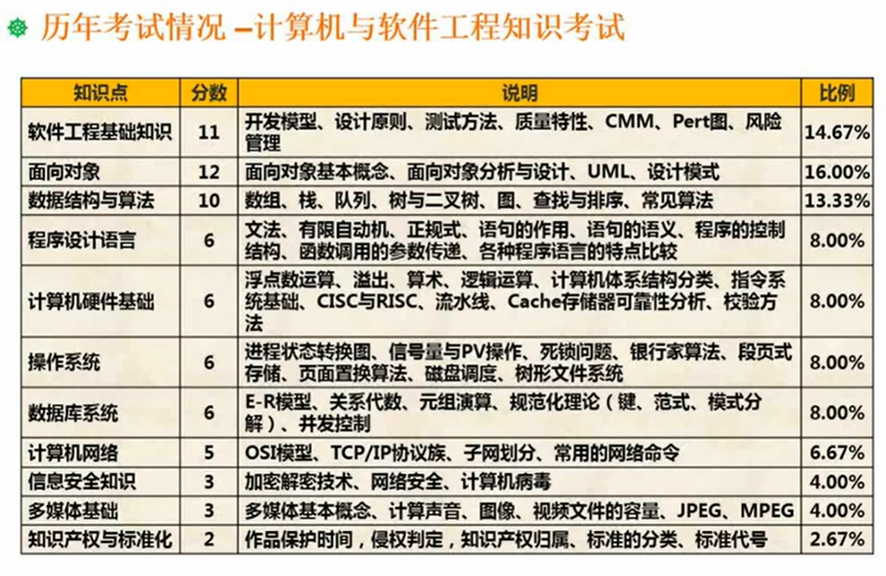
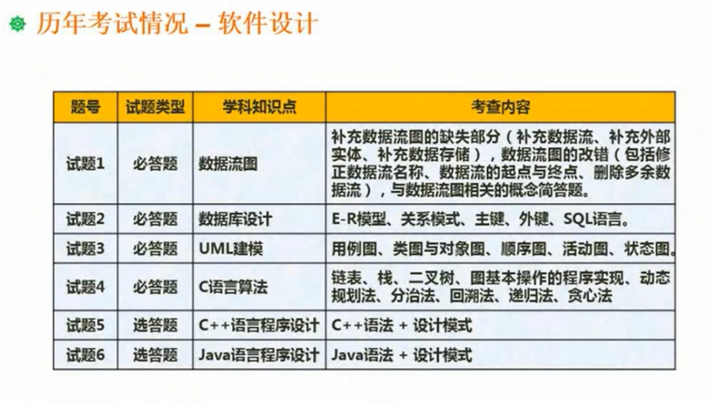

---

typora-copy-images-to: img
---

考试大纲：

1、掌握计算机内的数据表示、算术和逻辑运算方法；

2、掌握相关的应用数学及离散数学基础知识；

3、掌握计算机体系结构以及各主要部件的性能和基本工作原理

4、掌握操作 系统、程序设计语言的基础知识，了解编译程序的基本知识；

5、熟练掌握常用数据结构和常用算法

6、熟悉数据库、网络和多媒体的基础知识

7、掌握c程序设计语言，以及c++、java中的一种程序设计语言

8、熟悉软件工程、软件过程改进和软件开发项目管理的基础知识

9、掌握软件设计的方法和技术

10、了解信息化、常用信息技术标准、安全性，以及有关法律、法规的基础知识

11、正确阅读和理解计算机领域的英文资料

考试形式：

​	计算机与软件工程知识：150分钟，笔试，选择题

​	软件设计：150分钟，笔试，问答题

