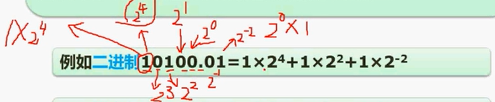
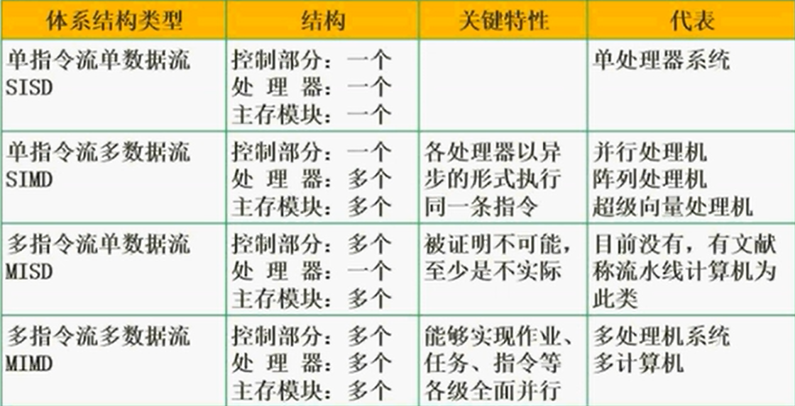

## 计算机硬件基础

### R进制转十进制使用按权展开法：

```tex
将R进制数的每一位数值用R^k形式表示，即幂的底数是R，指数为k,k与该位和小数点之间的距离有关
当该位位于小数点左边，k值是该位和小数点之间数码的个数
而当该位位于小数点右边，k值是负值，其绝对值是该位和小数点之间数码的个数加1

例如二进制：10100.01 = 1*2^4 + 1*2^2 + 1*2^-2
例如七进制：604.01 = 6*7^2 + 4*7^0 + 1*7^-2
```



### 十进制转R进制使用短除法：

```tex
例如：将94转为二进制

2/94			余0
2/47			余1
2/23			余1
2/11			余1
2/5				余1
2/2				余0
2/1				余1
即得到二进制为：1011110
余数从下往上获取
```

### 二进制转八进制和十六进制：

```tex
八进制：
	例10001110
	从右往左将三个数分成一组，不够补0
	获得：010 001 110
		 421 421 421
		 2	 1	 6
	即最后获取216

十六进制：0~9、A、B、C、D、E、F
十六进制：
	例10001110
	从右往左将四个数分成一组，不够补0
	获得：1000 1110
		 8421 8421
		 8	  E
	即最后获取：8E
```

### 数据表示有：原码、反码、补码、移码

```tex
将数转成二进制，如果不够八位则往左补0
原码：
	例1：00000001		正数
		第一个0为符号位
	例-1：10000001	负数
		第一个1为符号位
	正数中符号位为0，负数中符号位为1

反码：
	例1：00000001		正数
		和原码的正数相同
	例-1：10000001	负数
		符号位不变，其余的0转成1，1转成0

补码：
	例1：00000001		正数
		和原码的正数相同
	例-1：11111111	负数
		在反码的基础上+1，即反码11111110 + 00000001 = 11111111

移码：
	例1：10000001		正数
		在补码的基础上将符号位取反，即补码00000001符号位取反 = 10000001
	例-1：01111111	负数
		在补码的基础上将符号位取反，即补码11111111符号位取反 = 01111111
		
原码求补码：
	如果是正数，则和原码相同
	如果是负数，则先将原码除符号位外全部取反转换成反码，在将反码+00000001，就可以得出补码

补码求原码：
	如果是正数，则和补码相同
	如果是负数，则先将补码除符号位外全部转换成反码，在将反码+00000001，就可以得出原码
```

### 数值的表示范围：

```
原码：-(2^n-1 -1) ~ 2^n-1 -1
反码：-(2^n-1 -1) ~ 2^n-1 -1
补码：-2^n-1 ~ 2^n-1 -1

例：n=8
原码：-(2^7 -1) ~ 2^7 -1
	= -127 ~127

反码：-(2^7 -1) ~ 2^7 -1
	= -127 ~127

补码：-2^7 ~ 2^7 -1
	= -128 ~ 127
```

### 数据表示——浮点数运算：

```tex
浮点数表示：
N = M * R^e
其中M称为尾数，R为基数，e是指数
例：
	119 = 1.19 * 10^2
	N   =  M   * R^e
对阶 --> 尾数计算 --> 结果格式化
例：119 + 1000
	119 = 1.19 * 10^2
	1000 = 1 * 10^3
	对阶：从低往高
		119 = 0.119 * 10^3
		1000 = 1 * 10^3
	尾数计算：0.119 + 1 = 1.119,即得到0.119 * 10^3
	结果格式化：
		例：尾数计算后得出11.19 * 10^2这样就要进行结果格式化，因为小数点前的数量不能超过1位
		则应该将11.19 * 10^2 转换成 1.119 * 10^3
		如果本来就只有一位则不需要转换
```

### 计算机结构

```html
主机包含：CPU和主存储器
CPU中有运算器和控制器

运算器包含：
	算术逻辑单元ALU
	累加寄存器AC
	数据缓冲寄存器DR
	状态条件寄存器PSW：用来存储运算过程中的相关的标志位
控制器包含：
	程序计数器PC
	指令寄存器IR
	指令译码器
	时序部件
```

### 计算机体系结构分类——Flynn

